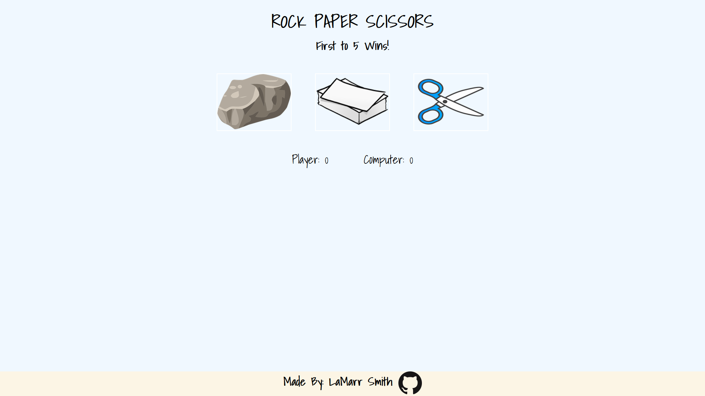

FINAL UPDATE!!
I completed my version of Rock-Paper-Scissors! This project was very helpful for me because it was the first time I was exposed to using JavaScript. I learned how to manipulate the DOM, use eventListeners, and add/remove elements within the DOM using JS.
Link to RPS: https://lamarr-smith17.github.io/rps-js/

UPDATE 02/03/2022
I have added buttons and the results now display on the page! No more console logs! However, I still have the older version of just console logs to show my growth.
By updating my RPS game, I learned how to manipulate the DOM and use eventListeners. My next goal is to add some style to the game. 
     
A recreation of the worldwide hit game Rock-Paper-Scissors! One of the projects on The Odin Project.
This is game is only playable in the console currently, however, I will be coming back to this and adding HTML/CSS styles to make this an actual playable game!
By creating this with JavaScript, I learned how to use functions and how to call them from within each other.
